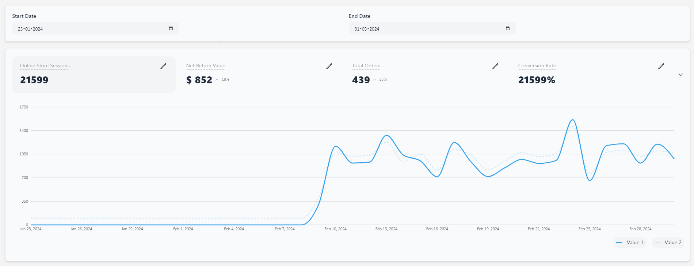

<div align="center">
    <strong>Dashboard created with Refine and Daisy UI blog template</strong>
</div>


## About

This application compares the different values of the selected matrix similar to the given figma design.


## Approach

This approach is to create a genral example of the dashboard provided.

This application can compare 2 different values or the value between 2 time periods depending upon the data provided in 'data' and 'lines' fields in tabs.

- Starts with creating a general responsive line chart which shows any number of lines given and compare the details with tooltip.
- Add stats section as required and make it general to add any number of metrics (tabs variable) with all different values (data and lines fields).
- Add all click and modals functionalities required.
- Add date range picker for comparision.


## Quick Start

Run the following command to clone the project:

```
git clone https://github.com/himanshuvarandani/blog-refine-daisyui.git
```

Once the setup is complete, navigate to the project folder and install dependencies:

```
npm i
```

Start your project with:

```
npm run dev
```

Your application will be accessible at http://localhost:5173


### Screenshots

Dashboard


Change chart metric


Drop down Menu for more metric selections


Tooltip for Metric Comparision


Overlay for Metric Description


Closed Chart Panel


Change date range for comparison



### Resources

Refer to [Refine daisyUi blog](https://refine.dev/blog/daisy-ui-react-admin-panel/).

Refer to [daisyUI docs](https://daisyui.com/docs/install/) for more information.

Refer to complete CRUD app [tutorial](https://refine.dev/docs/tutorial/introduction/index/) to learn more about refine.
